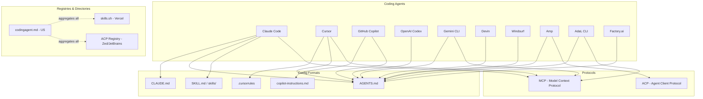
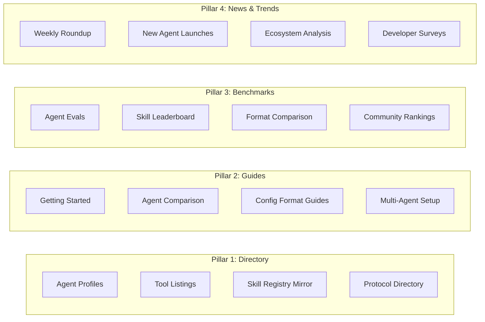
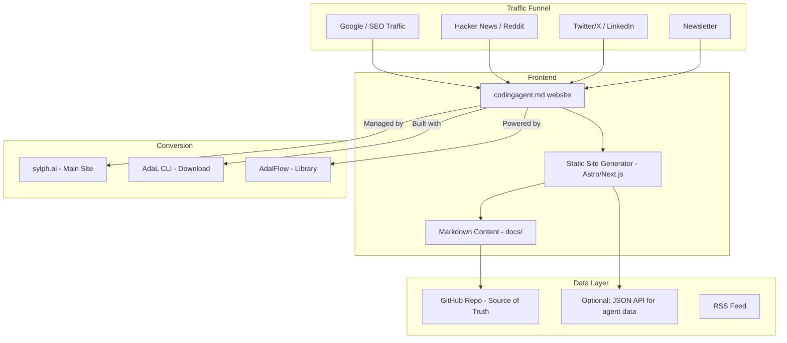
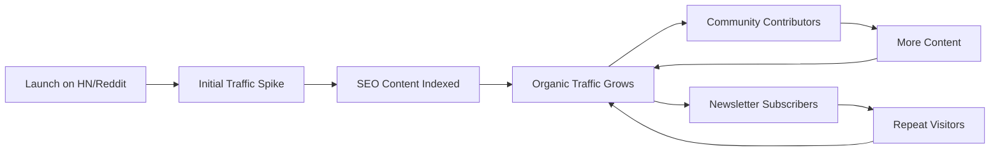

# codingagent.md — Strategic Plan

**Date**: 2026-02-07
**POC**: Li / Sylph.AI
**Domain**: codingagent.md
**Status**: Planning

---

## TL;DR

codingagent.md will be the **definitive aggregator and knowledge hub** for the AI coding agent ecosystem. By owning the `.md` domain — the same namespace as AGENTS.md, CLAUDE.md, and every agent config file — we position ourselves as the canonical directory. The site drives traffic to sylph.ai and establishes AdaL CLI as a key player in the ecosystem.

**Tagline**: *"The coding agent ecosystem, documented."*
**Managed by** [Sylph.AI](https://sylph.ai) · **Built with** [AdaL CLI](https://github.com/adal-cli/adal)

---

## 1. Ecosystem Landscape (As of Feb 2026)

### 1.1 The Fragmentation Problem

The AI coding agent space has exploded but is deeply fragmented:



### 1.2 Key Players & Metrics

| Initiative | Owner | What It Is | Scale | Domain |
|-----------|-------|-----------|-------|--------|
| AGENTS.md | OpenAI / Linux Foundation | Open format for agent instructions | 60K+ repos | agents.md |
| skills.sh | Vercel | NPM-like skill registry | 35K+ installs | skills.sh |
| CLAUDE.md | Anthropic | Claude Code project config | Millions of users | N/A (file) |
| .cursorrules | Cursor | Cursor-specific rules | Massive adoption | N/A (file) |
| ACP Registry | Zed / JetBrains | Agent directory + protocol | Growing | zed.dev/acp |
| copilot-instructions.md | GitHub | Copilot config | GitHub ecosystem | N/A (file) |
| **codingagent.md** | **Sylph.AI / AdaL** | **Ecosystem aggregator** | **New** | **codingagent.md** |

### 1.3 The .md Domain Advantage

The `.md` TLD is uniquely powerful in the coding agent space:
- Every agent config is a `.md` file (AGENTS.md, CLAUDE.md, SKILL.md)
- Developers associate `.md` with documentation and developer tools
- `agents.md` already proved the domain-as-brand strategy works
- **codingagent.md** naturally reads as both a domain AND a file name

---

## 2. Strategic Positioning

### 2.1 We Are NOT Competing With

| Player | Their Role | Our Relationship |
|--------|-----------|-----------------|
| agents.md | Defines the format | We document & promote it |
| skills.sh | Hosts skills | We catalog & review skills |
| ACP Registry | Lists ACP agents | We list ALL agents, including ACP |
| Individual agents | Build the tools | We compare & guide users to them |

### 2.2 We ARE

- **The Wikipedia of coding agents** — comprehensive, neutral, constantly updated
- **The Product Hunt for agent tools** — discovery, comparison, trending
- **The MDN Web Docs for agent configs** — authoritative how-to guides
- **The aggregator that drives traffic** — to sylph.ai, to AdaL, to the whole ecosystem

### 2.3 Competitive Moat

1. **Domain brand**: codingagent.md is memorable, SEO-powerful, and namespace-native
2. **Content depth**: Not just listings — deep guides, benchmarks, comparisons
3. **Neutral aggregator**: We cover ALL agents, not just our own
4. **Built by practitioners**: AdaL CLI is a real agent, giving us credibility
5. **First mover**: No one owns the "aggregator" position yet

---

## 3. Content Strategy

### 3.1 Content Pillars



### 3.2 SEO-First Content Plan

**Target Keywords** (Monthly Search Volume estimates):

| Keyword Cluster | Priority | Content Type |
|----------------|----------|--------------|
| "AI coding agent" / "best AI coding agent 2026" | 🔴 High | Comparison pages |
| "AGENTS.md" / "how to write AGENTS.md" | 🔴 High | Guide + template |
| "CLAUDE.md" / "CLAUDE.md best practices" | 🔴 High | Guide + examples |
| "cursor rules" / ".cursorrules examples" | 🔴 High | Guide + templates |
| "Claude Code vs Cursor vs Copilot" | 🔴 High | Comparison table |
| "AI coding agent setup" | 🟡 Medium | Tutorial series |
| "MCP vs ACP protocol" | 🟡 Medium | Technical comparison |
| "Vercel skills" / "skills.sh" | 🟡 Medium | Mirror + reviews |
| "coding agent benchmarks" | 🟡 Medium | Eval results |
| "multi-agent coding setup" | 🟢 Growing | Advanced guide |

### 3.3 Content Calendar (First 90 Days)

**Week 1-2: Foundation**
- [ ] Launch landing page at codingagent.md
- [ ] Publish ecosystem landscape map
- [ ] Write 5 core agent profiles (Claude Code, Cursor, Copilot, Codex, AdaL)
- [ ] Write 3 format guides (AGENTS.md, CLAUDE.md, .cursorrules)

**Week 3-4: Depth**
- [ ] Publish agent comparison table (interactive)
- [ ] Write "Getting Started with AI Coding Agents" mega-guide
- [ ] Launch weekly newsletter / roundup
- [ ] Write protocol comparison (MCP vs ACP)

**Month 2: Community**
- [ ] Launch "Submit Your Agent" feature
- [ ] Publish first benchmark results
- [ ] Start GitHub discussions for community contributions
- [ ] Write 10 more agent profiles (Gemini CLI, Devin, Windsurf, Amp, etc.)

**Month 3: Growth**
- [ ] Launch skill/tool review system
- [ ] Publish developer survey results
- [ ] Create embeddable badges ("Listed on codingagent.md")
- [ ] Start SEO link-building campaign

---

## 4. Technical Architecture

### 4.1 Site Stack



### 4.2 Design Principles

1. **Content-first**: Markdown-driven, fast, no bloat
2. **SEO-optimized**: SSR/SSG, structured data, fast load times
3. **Community-editable**: PRs to add/update agents, like awesome-lists
4. **Branded**: Clear Sylph.AI / AdaL branding without being overbearing
5. **Mobile-friendly**: Developers read on phones too

### 4.3 Recommended Stack

| Layer | Choice | Why |
|-------|--------|-----|
| Framework | Astro | Best for content sites, SSG, fast, MD-native |
| Hosting | Vercel or Cloudflare Pages | Free tier, fast CDN, edge |
| Content | Markdown in Git | Easy to contribute, version-controlled |
| Search | Pagefind (client-side) | No server needed, fast |
| Analytics | Google Search Console + Plausible | SEO insights + privacy-friendly |
| Newsletter | Buttondown or Beehiiv | Developer-friendly |

---

## 5. Traffic & Growth Strategy

### 5.1 SEO Strategy

**Domain Authority Building:**
1. Publish authoritative, long-form content that others link to
2. Get listed in "awesome" lists and developer directories
3. Create linkable assets (comparison tables, infographics, benchmarks)
4. Submit to HN, Reddit, dev.to, Hashnode for initial traffic

**On-Page SEO:**
- Each agent profile = dedicated URL (codingagent.md/agents/claude-code)
- Each format guide = dedicated URL (codingagent.md/formats/agents-md)
- Structured data (JSON-LD) for software listings
- Internal linking between related content

**Content Velocity:**
- Aim for 20+ pages in first month
- Update existing pages weekly (freshness signal)
- User-generated content via GitHub PRs

### 5.2 Community Growth



**Growth Tactics:**
1. **Launch post on HN**: "codingagent.md — The Aggregator for AI Coding Agents"
2. **Reddit presence**: r/ClaudeAI, r/ChatGPTCoding, r/LocalLLaMA, r/codex
3. **Twitter/X threads**: Weekly ecosystem updates, agent comparisons
4. **LinkedIn articles**: For enterprise audience
5. **YouTube/video**: Agent comparison videos, setup tutorials
6. **Embeddable badges**: Agents can add "Listed on codingagent.md" badges
7. **GitHub stars**: Make the repo itself popular (awesome-list effect)

### 5.3 Traffic → Sylph.AI Funnel

```
codingagent.md visitor
  → Reads agent comparison
  → Sees AdaL CLI listed alongside Claude Code, Cursor
  → Sees "Managed by Sylph.AI" footer
  → Clicks through to sylph.ai
  → Downloads AdaL CLI
```

**Key conversion points:**
- Footer: "Managed by [Sylph.AI](https://sylph.ai) · Built with [AdaL CLI](https://github.com/adal-cli/adal)"
- AdaL agent profile prominently featured (not artificially ranked, but well-documented)
- "Try AdaL CLI" CTA on relevant guide pages
- Newsletter includes AdaL updates alongside ecosystem news

---

## 6. Monetization (Future)

### Phase 1: Free (Month 1-6)
- All content free
- Build traffic and authority
- No ads

### Phase 2: Sponsored (Month 6+)
- Sponsored agent profiles ("Featured Agent")
- Sponsored newsletter spots
- Enterprise benchmark reports

### Phase 3: Premium (Year 1+)
- Premium comparison tools
- API access to agent data
- Consulting / advisory for companies choosing agents

---

## 7. Branding

### 7.1 Visual Identity

- **Primary color**: Match Sylph.AI green (#00D67E or similar)
- **Typography**: Mono/code font for headings (developer aesthetic)
- **Logo**: `codingagent.md` in monospace, with a subtle cursor blink animation
- **Favicon**: Green terminal cursor or `>_` icon

### 7.2 Voice & Tone

- **Authoritative but approachable**: Like MDN Web Docs
- **Neutral**: We cover ALL agents fairly (builds trust)
- **Technical**: Written by developers, for developers
- **Current**: Always up-to-date (this is the key differentiator)

### 7.3 Taglines (Options)

1. "The coding agent ecosystem, documented."
2. "Every agent. Every format. One place."
3. "Navigate the coding agent landscape."
4. "The developer's guide to AI coding agents."

---

## 8. Competitive Analysis

### 8.1 agents.md (60K repos)
- **What they do well**: Simple open standard, Linux Foundation backing, broad adoption
- **Gap we fill**: They define a format; we document the entire ecosystem
- **Relationship**: Complementary — we're the guide TO agents.md

### 8.2 skills.sh / Vercel (35K installs)
- **What they do well**: NPM-like UX, leaderboard, easy install
- **Gap we fill**: They only cover Vercel skills; we cover all agents + skills + protocols
- **Relationship**: We mirror/review their skills alongside other ecosystems

### 8.3 ACP Registry (Zed/JetBrains)
- **What they do well**: Protocol standard, IDE integration
- **Gap we fill**: They only list ACP-compatible agents; we list everything
- **Relationship**: We include ACP agents in our directory

### 8.4 awesome-cursorrules (GitHub)
- **What they do well**: Community-driven .cursorrules collection
- **Gap we fill**: We cover ALL config formats, not just Cursor
- **Relationship**: We link to them and expand beyond Cursor

### 8.5 No Direct Competitor
**Nobody currently occupies the "neutral aggregator" position.** This is our opening.

---

## 9. Implementation Roadmap

### Phase 1: Content Foundation (Week 1-2)
1. Set up Astro site scaffolding
2. Create 5 agent profiles
3. Create 3 format guides
4. Create ecosystem landscape page
5. Deploy to codingagent.md domain

### Phase 2: Launch (Week 3-4)
1. Write launch blog post
2. Submit to HN, Reddit, Twitter
3. Set up newsletter
4. Add comparison tables
5. Set up analytics

### Phase 3: Community (Month 2)
1. Enable GitHub PR contributions
2. Add "Submit Your Agent" flow
3. Publish first benchmarks
4. Create embeddable badges
5. Start weekly newsletter

### Phase 4: Scale (Month 3+)
1. 50+ agent profiles
2. Interactive comparison tool
3. API for agent data
4. Sponsored listings
5. Developer surveys

---

## 10. Success Metrics

| Metric | Month 1 | Month 3 | Month 6 | Year 1 |
|--------|---------|---------|---------|--------|
| Pages published | 20 | 50 | 100 | 200+ |
| Monthly visitors | 5K | 20K | 50K | 200K+ |
| GitHub stars | 100 | 500 | 2K | 10K+ |
| Newsletter subs | 200 | 1K | 5K | 20K+ |
| sylph.ai referrals | 500 | 2K | 10K | 50K+ |
| Domain authority | 10 | 20 | 35 | 50+ |
| Community PRs | 5 | 20 | 50 | 200+ |

---

## 11. Risks & Mitigations

| Risk | Likelihood | Impact | Mitigation |
|------|-----------|--------|-----------|
| agents.md launches own directory | Medium | High | Move fast, build community moat |
| Low initial traffic | High | Medium | SEO + HN/Reddit launches |
| Content goes stale | Medium | High | Community contributions + automated checks |
| Perceived as biased toward AdaL | Medium | Medium | Rigorous neutrality in reviews |
| Competitor copies concept | Low | Low | First-mover + domain advantage |

---

## 12. Immediate Next Steps

1. ✅ Research ecosystem (DONE)
2. ✅ Create repo and plan (DONE)
3. [ ] Set up Astro site with Markdown content pipeline
4. [ ] Write first 5 agent profiles
5. [ ] Write first 3 format guides
6. [ ] Create landing page design
7. [ ] Configure DNS for codingagent.md domain
8. [ ] Deploy MVP site
9. [ ] Write and submit HN launch post
10. [ ] Set up PostHog analytics
